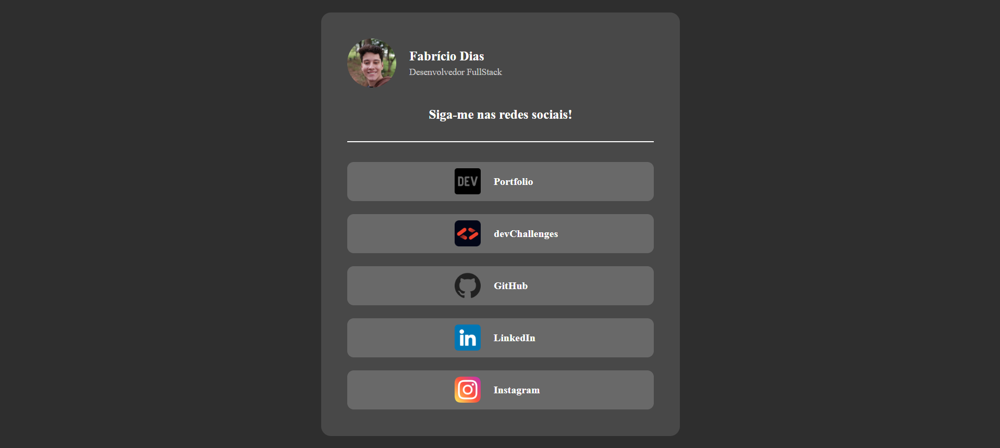

# 🔗 Linktree  

> Um Linktree personalizado desenvolvido com HTML e CSS, inspirado em um desafio do devChallenges criado por um desenvolvedor americano.  

## 📸 Imagem do Projeto  
  

## 🛠️ Tecnologias Utilizadas  
- HTML5  
- CSS3  

```bash
# Clone o repositório
git clone https://github.com/fcdias0812/linktree

# Acesse a pasta do projeto
cd linktree

# Abra o arquivo index.html no navegador
```

## 🎯 Aprendizados  
Esse projeto faz parte dos desafios do [devChallenges.io](https://devchallenges.io/) e foi uma ótima oportunidade para praticar estilização e organização de layouts responsivos.  

## 📞 Contato  
📧 Email: dias.fabricio0812@gmail.com  
💼 LinkedIn: [Acesse meu LinkedIn](https://www.linkedin.com/in/fcdias0812/)  
👨🏻‍💻 devChallenges: [Acesse meu devChallenges](https://devchallenges.io/profile/ddc059be-9eb4-40fb-b8cd-6f8dcd32b468)  
